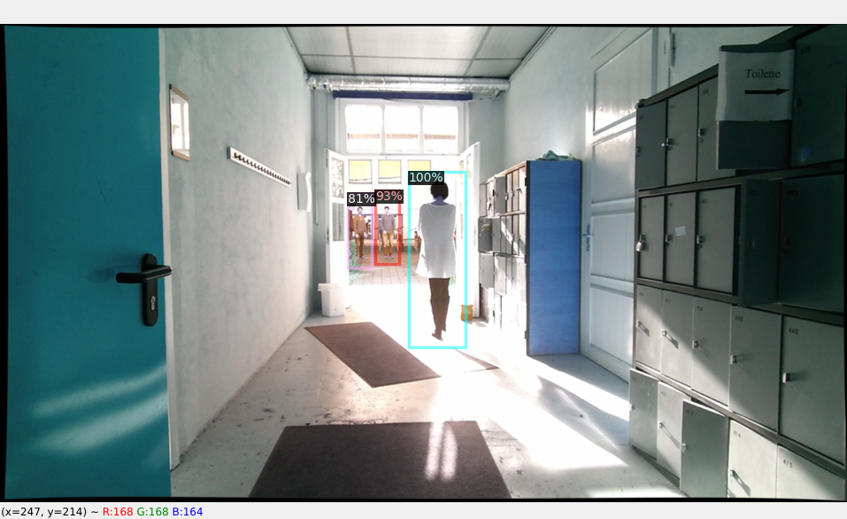
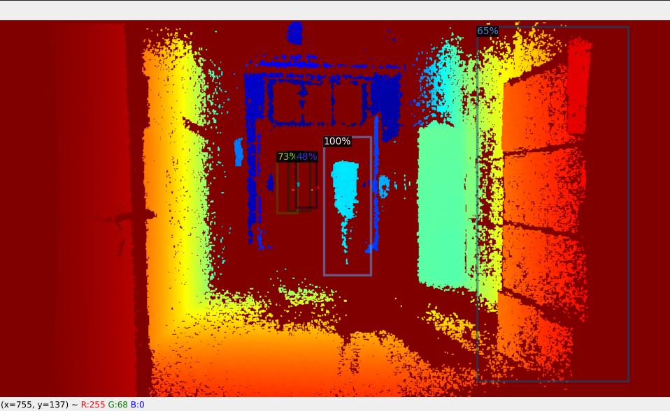
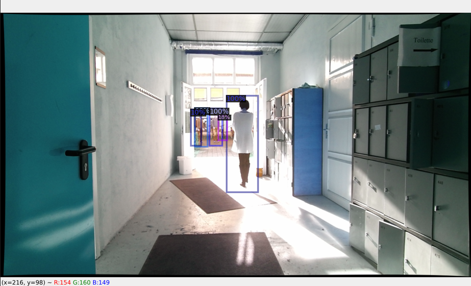

# MixtureOfDeepExperts

This is implementation is loosely based on the paper "Choosing smartly". It incorporates multiple CNN detectors "Experts"and combines their output using a gated weighting network.


## Sample outputs:
| RGB channel    | Depth Channel       | Gating network |
| -------------- | -------------- | ---------|
 |   || 


## Dependencies :

* detectron2
* pytorch 1.7.0 + cuda 11.0
* [InOutDoorPeople dataset](http://adaptivefusion.cs.uni-freiburg.de/#dataset)
* download and extract the dataset from above link and modify the data path accordingly before executing.  

## Training :

To train CNN "Experts" Models over single modality use the below code, eg , RGB or Depth
```shell
usage: train_singleExpert.py [-h] [--modality_path MODALITY_PATH]
                             [--batch_size BATCH_SIZE] [--workers WORKERS]
                             [--iterations ITERATIONS] [--out_dir OUT_DIR]
optional arguments:
  -h, --help            show this help message and exit
  --modality_path MODALITY_PATH
                        path to RGB model
  --batch_size BATCH_SIZE
                        batch size for dataloader
  --workers WORKERS     no of workers for dataloader
  --iterations ITERATIONS
                        no. of iterations for training
  --out_dir OUT_DIR     output directory to save models
```


After training the CNN Expert models train the gating network using checkpoints from the above outputs

```shell
Training Gating network
usage: train_gatingNetwork.py [-h] [--model1 MODEL1] [--model2 MODEL2]
                              [--batch_size BATCH_SIZE]
                              [--no_of_workers NO_OF_WORKERS] [--data DATA]
                              [--epoch EPOCH] [--out_dir OUT_DIR]

optional arguments:
  -h, --help            show this help message and exit
  --model1 MODEL1       path to RGB model
  --model2 MODEL2       path to Depth model
  --batch_size BATCH_SIZE
                        batch size for dataloader
  --no_of_workers NO_OF_WORKERS
                        no of workers for dataloader
  --data DATA           path to InOutDoorData
  --epoch EPOCH         no. of epochs for training
  --out_dir OUT_DIR     output directory to save models

```


## Evaluation : 
Use the below commands to evaluate the trained models.
 ```shell
usage: eval_single.py [-h] [--modality_path MODALITY_PATH] [--data DATA]
                      [--batch_size BATCH_SIZE] [--workers WORKERS]
                      [--iterations ITERATIONS] [--out_dir OUT_DIR]
optional arguments:
  -h, --help            show this help message and exit
  --modality_path MODALITY_PATH
                        path to RGB model
  --data DATA           data directory to save models
  --batch_size BATCH_SIZE
                        batch size for dataloader
  --workers WORKERS     no of workers for dataloader
  --iterations ITERATIONS
                        no. of iterations for training
  --out_dir OUT_DIR     output directory to save models
```
```shell
usage: eval_gating.py [-h] [--model1 MODEL1] [--model2 MODEL2] [--gated GATED]
                      [--data DATA] [--out_dir OUT_DIR]
optional arguments:
  -h, --help         show this help message and exit
  --model1 MODEL1    path to RGB model
  --model2 MODEL2    path to Depth model
  --gated GATED      path to gated model
  --data DATA        path to InOutDoorData
  --out_dir OUT_DIR  output directory to save models

```
